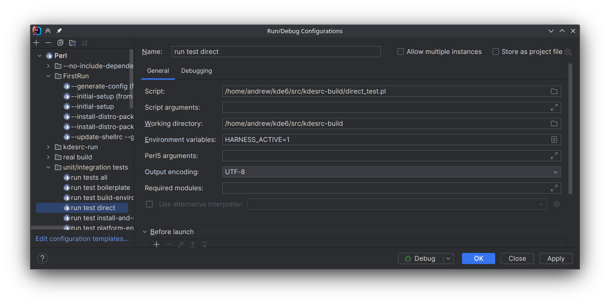

<!--
    SPDX-FileCopyrightText: 2018 Michael Pyne <mpyne@kde.org>
    SPDX-FileCopyrightText: 2024 Andrew Shark <ashark@linuxcomp.ru>
    SPDX-License-Identifier: CC-BY-4.0
-->

# Tests

## Running tests

To run tests, make sure you have `TAP::Harness` and `Test::More` installed, and run

```
prove -I modules -r
```

from the `kdesrc-build` base directory.  The `-I` flag adds `kdesrc-build`'s own
internal modules to the search path by default.

This will run all tests under `t/`, including any (nested) subdirectories.

If you want to run specific tests then do

```
prove -I modules t/*.t
```

Replace the last parameter with the tests you want.

# Debugging tests

To be able to run test files as a normal perl file with debugger, you can
create the following script (for example, name it as `direct_test.pl`):

```perl5
#!/usr/bin/perl
use strict;
use warnings FATAL => 'all';

BEGIN {
    push @INC, "/home/username/kde6/src/kdesrc-build/modules";
}

require("/home/username/kde6/src/kdesrc-build/t/integration/branch-time-based.t");
```

In the **Run/Debug Configurations** create a configuration with the path to the script
and working directory. Also, you must add `HARNESS_ACTIVE=1` environment variable, because
some code in `kdesrc-build` has conditions depending on if it is running under testing.



In the "Debugging" tab, in "Debugger startup mode" field, select "Stop at first breakpoint".
